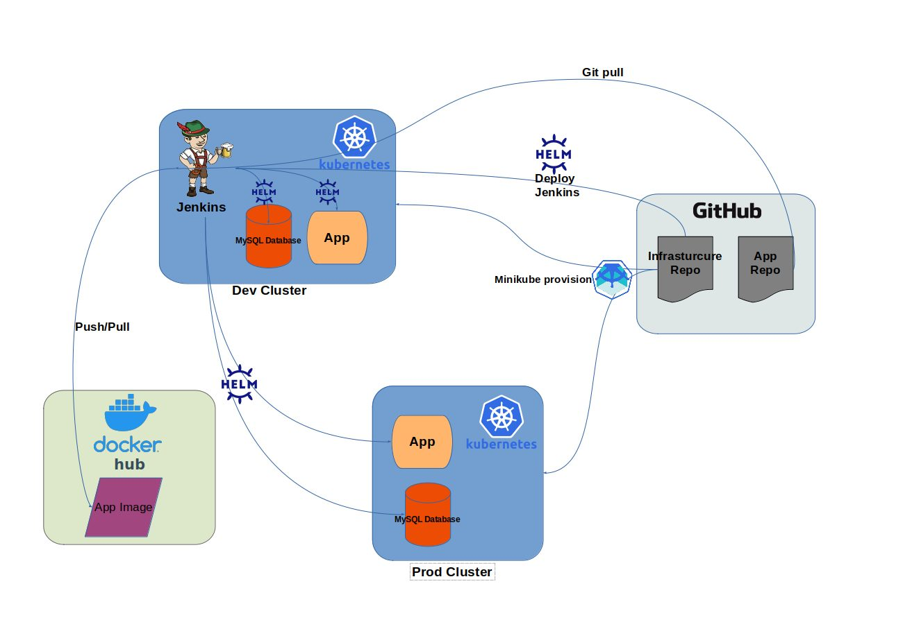

# Kubernetes IaC for [NodeJS Hello App](https://github.com/Shivox/nodejs-hello)

This is the IaC repo that builds the underlying infrastructure that continuously builds and deploys a sample NodeJS app hosted at
https://github.com/Shivox/nodejs-hello
## Overview:
This diagrams shows an overview of this whole architecture, continue further for details about what this automated bootstrap script does.



## Required tools:
These tools need to be present on the system before running the setup script (installation linked)

- [Kubectl](https://kubernetes.io/docs/tasks/tools/install-kubectl/)
- [Minikube](https://kubernetes.io/docs/tasks/tools/install-minikube/)
- [Helm](https://helm.sh/docs/intro/install/)

## How to setup:
> Disclaimer: This was developed and tested in a Linux environment, might need some tweaks to the setup script to work under macOS because of the minor discrepancies in the basic UNIX tools implementation (`sed` for instance). Test to find out.

1. Clone this repo locally
2. Run the setup script like the following:
```
./setup.sh -t [dockerhub_token] -d [minikube_vm_driver]
```
>I recommend using either `virtualbox` driver or `kvm2` (I tested both of those).
3. After the script completes, append the values shown to `/etc/hosts`
4. After the Jenkins pods starts and is ready, point your browser towards Jenkins at http://jenkins.ppro.dev/ and login with `admin` then get your password from `printf $(kubectl get secret --namespace default jenkins -o jsonpath="{.data.jenkins-admin-password}" | base64 --decode);echo`
> You might need to disable HSTS checking in the browser in order to access the sites, as minikube ingress addon sadly cannot be configured with correct certs without a dirty mess, check [this](https://tutoref.com/how-to-prevent-firefox-and-chrome-from-forcing-dev-and-foo-domains-to-use-https/) for how to do that.
5. Run the pipelines in the following order:
    1. `nodejs-hello-build` : builds the docker image and pushes it to Dockerhub
    2. `nodejs-hello-deploy-dev` : deploys the app to dev environment, accessible under http://nodejs-hello.ppro.dev/
    3. `nodejs-hello-deploy-prod` : deploys the app to prod environment, accessible under http://nodejs-hello.ppro.prod/

# How the automated setup works:
- Provisions two minikube clusters
- Create required Kubernetes RBAC objects for helm to run and deploy charts
- Deploys a Jenkins chart using helm and loads the required configuration using Jenkin's Configuration as Code plugin:
    - 3 piplelines (jobs) to build and deploy the project
    - 2 clouds, one for dev cluster and the second for prod cluster
    - Required plugins and runtime configurations.
- Once Jenkins is up and running the build/deploy works out of the box.

# Things that could be improved:
As this is just a demonstration, a lot of things could've been improved:
- HA database
- HTTPS
- Dynamic DNS to avoid manually changing `/etc/hosts/`
- Using git branches with SymVer for app verionsing
- Hosting the artefacts (Docker images, Helm Charts) in the cluster using a tool like Artifactory instead of relying on Github and Dockerhub